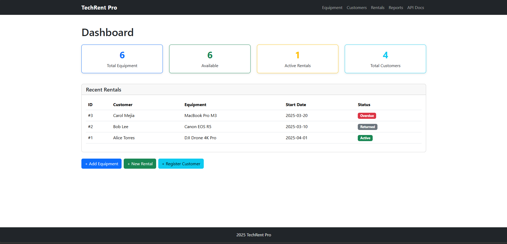

# TechRent Pro

## Screenshot


## Docker Hub
https://hub.docker.com/r/talkraus/techrent-pro

## Build & Run

### Build the Docker image
```sh
docker build -t talkraus/techrent-pro:latest .
```

### Run the container (maps host port 5000 to container port 5000)
```sh
docker run -p 5000:5000 talkraus/techrent-pro:latest
```

### Run with environment variables (e.g., for development)
```sh
docker run -p 5000:5000 --env-file .env talkraus/techrent-pro:latest
```

### Pull directly from Docker Hub
```sh
docker pull talkraus/techrent-pro:latest
```

### Open in browser
http://localhost:5000
